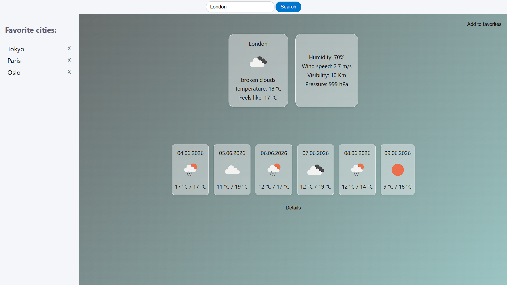
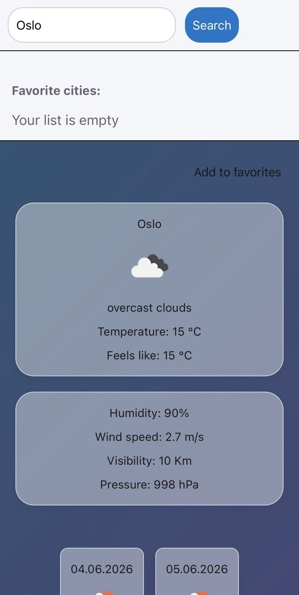

## Weather App




## About project
A weather app written in React. It shows the current weather and a 5-day forecast. You can add cities to a favorites list, and they are saved using localStorage. The project is adaptive and works on phones and computers.

## Main functions
- Search for cities
- Show current weather and 5-day forecast
- Add / remove cities from favorites
- Adaptive design for phones and computers
- Extra weather info (wind, humidity, pressure, visibility) – shown in a popup

## Demo
Link: https://hlibm24.github.io/weather-app/


## Stack
- Frontend: React
- Languages: JavaScript, HTML5, CSS3
- API: OpenWeatherMap API
- Deploy: GitHub Pages
- Tools: Vite, Git

## How to run locally

1. Clone the repository:
   ```bash
   git clone https://github.com/hlibm24/weather-app.git
   cd weather-app
   ```

2. Install dependencies:
    ```bash
    npm install
    ```

3. Get a free API key at [OpenWeatherMap](https://openweathermap.org/api).

4. Create a .env file in the root folder and add your key:
    VITE_WEATHER_API_KEY=your_api_key_here

5. Start the development server: 
    ```bash
    npm run dev
    ```

6. Open http://localhost:5173/ in your browser.